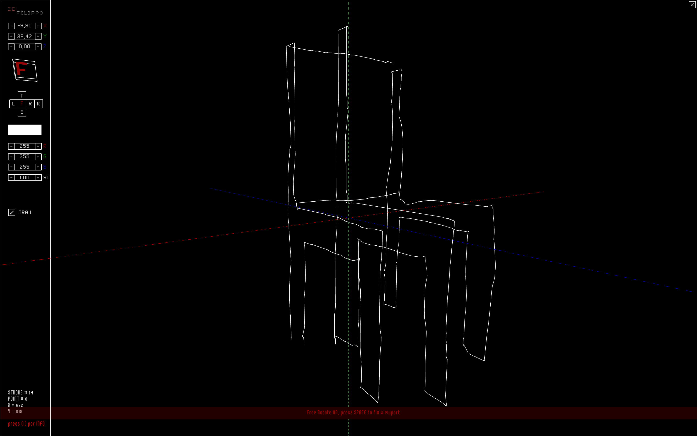

# Filippo 3D

This is a 3D drawing program built with [Processing](http://www.processing.org) and named after Filippo Brunelleschi, the inventor of perspective.

The basic principle of Filippo3D is to draw on the screen, which is the <code>z = 0</code> surface; you always have to fix your lines in that plane, but your drawing can move freely in 3D space. 

Drawings can be exported to single Pdfs, Pdf series like a flipbook of your model rotating and DXF. 

## Keys

### Views

* <code>F</code>ront
* <code>T</code>op
* <code>L</code>eft
* <code>R</code>ight
* <code>B</code>ottom
* bac<code>K</code>
* SPACEBAR or MOUSE RIGHT BUTTON switches to free rotation mode
 
### Model Translation

This modifications are relative to mouse position in the X dimension fo the screen. If the mouse is on the left side, it will substract from the values, if it's in the right side, it will add. The closer to the margins, the more the values change.

* <code>1</code> While pressed, translates the drawinng in X
* <code>2</code> While pressed, translates the drawinng in Y
* <code>3</code> While pressed, translates the drawinng in Z
 
### Model Scalation

This modifications are relative to mouse position in the X dimension fo the screen. If the mouse is on the left side, it will substract from the values, if it's in the right side, it will add. The closer to the margins, the more the values change.

* <code>4</code> While pressed, scales the drawinng in X
* <code>5</code> While pressed, scales the drawinng in Y
* <code>6</code> While pressed, scales the drawinng in Z
 
### Model Rotation
* <code>X</code> increases the rotation angle in X
* <code>x</code> decreases the rotation angle in X
* <code>Y</code> increases the rotation angle in Y
* <code>y</code> decreases the rotation angle in Y
* <code>Z</code> increases the rotation angle in Z
* <code>z</code> decreases the rotation angle in Z
 
### Exporting
* <code>p</code> exports a PDF of the current view
* <code>P</code> exports a series of 36 PDFs rotating in Y
* <code>d</code> exports a DXF of the 3D model
 
### Interface
* <code>i</code> Display information
* <code>A</code>xis turn ON/OFF
* <code>e</code>rase the selected stroke
* <code>u</code>ndo
* <code>m</code> changes current mode, draw or select
* <code>s</code> Select Everything
* <code>w</code> unselect everything
* <code>N</code> new drawing, erases everything and resets the view
* <code>,</code> reduce stroke size
* <code>.</code> increase stroke size

Original [blog post](http://www.herbertspencer.net/2006/filippo-3d-ver-01/) and comments [here](http://www.herbertspencer.net/2006/filippo-3d-ver-01/#comments), please. All feedback is highly appreciated.