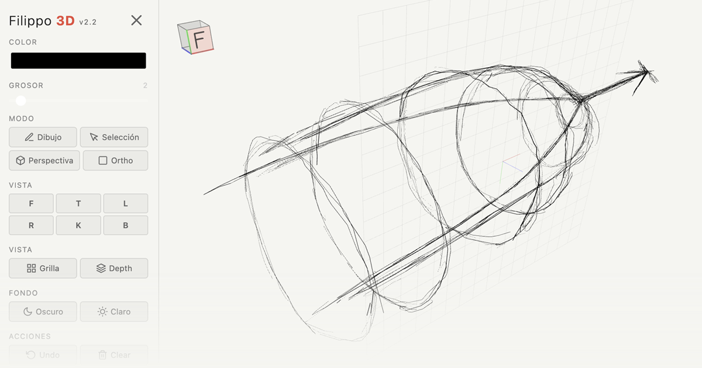

# Filippo 3D v2.4 

> 🇪🇸 Versión en español (abajo continúa la versión en inglés) · [English version ↓](#filippo-3d-v24-english)

Una herramienta de dibujo 3D que lleva el nombre de [Filippo Brunelleschi](https://es.wikipedia.org/wiki/Filippo_Brunelleschi), el inventor de la perspectiva, y pensada para el dibujo a mano alzada. Filippo 3D permite dibujar un croquis tridimensional —vistas yuxtapuestas o maquetas de alambre— que se pueden descargar e [incrustar en la wiki Casiopea](https://wiki.ead.pucv.cl/Widget:F3D).

**[Demo en vivo](https://herbertspencer.net/filippo3d/)**

## Principio

Siempre dibujas sobre el plano de la pantalla (`z = 0` de la vista actual). Puedes desplazar y rotar el modelo libremente, pero cada trazo se deposita sobre la superficie que ves — como dibujar sobre un vidrio colocado frente a una escena 3D.

## Referencia de interacción

### Dibujar

| Acción | Cómo |
|--------|-----|
| Dibujo a mano alzada | Click + arrastrar |
| Línea recta | `Shift` + arrastrar |
| Grosor del trazo −/+ | `,` / `.` |
| Deshacer | `Cmd/Ctrl` + `Z` |
| Borrar trazos seleccionados | `E` |
| Nuevo dibujo (limpiar todo) | `N` |

### Selección

| Acción | Cómo |
|--------|-----|
| Alternar modo Dibujo / Selección | `V` o botones del panel |
| Seleccionar un trazo | Click sobre el trazo (en modo selección) |
| Añadir a la selección | `Shift` + click |
| Selección por rectángulo | Arrastrar rectángulo (en modo selección) |

### Transformar la selección

| Acción | Cómo |
|--------|-----|
| Mover | Click derecho + arrastrar |
| | `Espacio` + arrastrar |
| Rotar alrededor de un eje | `X` / `Y` / `Z` + arrastrar |
| Escalar a lo largo de un eje | `Shift` + `X` / `Y` / `Z` + arrastrar |

### Navegación 3D

**Rotación**

| Acción | Cómo |
|--------|-----|
| Rotación libre (orbit) | Click central + arrastrar |
| | `Shift` + `Espacio` + arrastrar |
| Rotar alrededor de un eje | `X` / `Y` / `Z` + arrastrar |

**Desplazamiento (pan)**

| Acción | Cómo |
|--------|-----|
| Desplazar (mover origen) | Click derecho + arrastrar |
| | `Espacio` + arrastrar |
| Trasladar a lo largo de un eje | `Shift` + `X` / `Y` / `Z` + arrastrar |

**Profundidad (eje Z)**

| Acción | Cómo |
|--------|-----|
| Guía de profundidad on/off | `D` |
| Ajustar profundidad del dibujo | Rueda del mouse (con guía de profundidad activa) |

**Vistas preestablecidas**

| Acción | Cómo |
|--------|-----|
| Frente | `F` |
| Arriba / Abajo | `T` / `B` |
| Izquierda / Derecha | `L` / `R` |
| Atrás | `K` |

### General

| Acción | Cómo |
|--------|-----|
| Grilla y ejes on/off | `G` |
| Ortográfica / Perspectiva | `O` |
| Tema oscuro / claro | `M` |
| Mostrar / ocultar panel | `Tab` |
| Exportar PNG | `Cmd/Ctrl` + `S` |
| Guardar proyecto (.f3d) | Botón del panel |
| Cargar proyecto | Botón del panel |
| Superposición de ayuda | `?` |

## Resumen de botones del mouse

| Botón | Sin selección | Con selección |
|--------|-------------------|----------------|
| Click izquierdo | Dibujar (o seleccionar) | Seleccionar |
| Click central + arrastrar | Rotación libre (orbit) | Rotación libre (orbit) |
| Click derecho + arrastrar | Desplazar (pan) | Mover selección |
| Rueda del mouse | Ajustar profundidad[^1] | Ajustar profundidad[^1] |

[^1]: Sólo cuando la guía de profundidad está activa (`D`).

## Formato de archivo

Los dibujos se guardan como archivos `.f3d` (JSON). Los archivos `.json` antiguos siguen siendo compatibles al importar.

## Tecnología

- **p5.js** (WEBGL) para el renderizado 3D
- **Pointer Events API** para entrada unificada de mouse/touch/stylus con sensibilidad a la presión
- Soporte para presión del stylus (p. ej., Apple Pencil) — el grosor del trazo responde a la presión del lápiz
- Archivos estáticos puros — sin build step, sin dependencias
- Se despliega en GitHub Pages desde la rama `gh-pages`

## Legado

El programa original fue escrito en Processing (Java) en 2006, durante la clase [Interactive Image](https://golancourses.net/) impartida por el profesor [Golan Levin](https://www.flong.com/). Esa versión se conserva en la rama [`processing-original`](https://github.com/hspencer/filippo3d/tree/processing-original) y está etiquetada como [`v1.0`](https://github.com/hspencer/filippo3d/releases/tag/v1.0). [Entrada del blog original](https://herbertspencer.net/2006/12/filippo-3d-ver-01/).

## Licencia

[CC BY-NC-SA 4.0](https://creativecommons.org/licenses/by-nc-sa/4.0/) — Herbert Spencer

---

# Filippo 3D v2.4 (English)

> 🇬🇧 English version ([Versión en español arriba ↑](#filippo-3d-v24))

A 3D drawing tool named after [Filippo Brunelleschi](https://en.wikipedia.org/wiki/Filippo_Brunelleschi), the inventor of perspective. Built for teaching — draw on a projected screen with a stylus while your students watch, then rotate and explore the drawing in 3D space.

**[Live demo](https://herbertspencer.net/filippo3d/)**

## Principle

You always draw on the screen plane (`z = 0` of the current view). Pan and rotate the model freely, but every stroke is deposited on the surface you see — like drawing on glass in front of a 3D scene.

## Interaction reference

### Drawing

| Action | How |
|--------|-----|
| Freehand drawing | Click + drag |
| Straight line | `Shift` + drag |
| Stroke weight −/+ | `,` / `.` |
| Undo | `Cmd/Ctrl` + `Z` |
| Erase selected strokes | `E` |
| New drawing (clear all) | `N` |

### Selection

| Action | How |
|--------|-----|
| Toggle Draw / Select mode | `V` or panel buttons |
| Select a stroke | Click on stroke (in select mode) |
| Add to selection | `Shift` + click |
| Marquee selection | Drag rectangle (in select mode) |

### Transform selection

| Action | How |
|--------|-----|
| Move | Right-click + drag |
| | `Space` + drag |
| Rotate around axis | `X` / `Y` / `Z` + drag |
| Scale along axis | `Shift` + `X` / `Y` / `Z` + drag |

### 3D Navigation

**Rotation**

| Action | How |
|--------|-----|
| Free rotation (orbit) | Middle-click + drag |
| | `Shift` + `Space` + drag |
| Rotate around single axis | `X` / `Y` / `Z` + drag |

**Panning**

| Action | How |
|--------|-----|
| Pan (move origin) | Right-click + drag |
| | `Space` + drag |
| Translate along axis | `Shift` + `X` / `Y` / `Z` + drag |

**Depth (Z axis)**

| Action | How |
|--------|-----|
| Depth guide on/off | `D` |
| Adjust drawing depth | Scroll wheel (with depth guide active) |

**Preset views**

| Action | How |
|--------|-----|
| Front | `F` |
| Top / Bottom | `T` / `B` |
| Left / Right | `L` / `R` |
| Back | `K` |

### General

| Action | How |
|--------|-----|
| Grid and axes on/off | `G` |
| Orthographic / Perspective | `O` |
| Dark / Light theme | `M` |
| Show / hide panel | `Tab` |
| Export PNG | `Cmd/Ctrl` + `S` |
| Save project (.f3d) | Panel button |
| Load project | Panel button |
| Help overlay | `?` |

## Mouse button summary

| Button | Without selection | With selection |
|--------|-------------------|----------------|
| Left click | Draw (or select) | Select |
| Middle click + drag | Orbit (free rotation) | Orbit (free rotation) |
| Right click + drag | Pan | Move selection |
| Scroll wheel | Adjust depth[^2] | Adjust depth[^2] |

[^2]: Only when the depth guide is active (`D`).

## File format

Drawings save as `.f3d` files (JSON). Older `.json` files are still supported on import.

## Tech

- **p5.js** (WEBGL) for 3D rendering
- **Pointer Events API** for unified mouse/touch/stylus input with pressure sensitivity
- Stylus pressure support (e.g., Apple Pencil) — stroke weight responds to pen pressure
- Pure static files — no build step, no dependencies
- Deploys to GitHub Pages from `gh-pages` branch

## Legacy

The original program was written in Processing (Java) in 2006, during the [Interactive Image](https://golancourses.net/) class taught by professor [Golan Levin](https://www.flong.com/). That version is preserved in the [`processing-original`](https://github.com/hspencer/filippo3d/tree/processing-original) branch and tagged as [`v1.0`](https://github.com/hspencer/filippo3d/releases/tag/v1.0). Original [blog post](https://herbertspencer.net/2006/12/filippo-3d-ver-01/).

## License

[CC BY-NC-SA 4.0](https://creativecommons.org/licenses/by-nc-sa/4.0/) — Herbert Spencer
