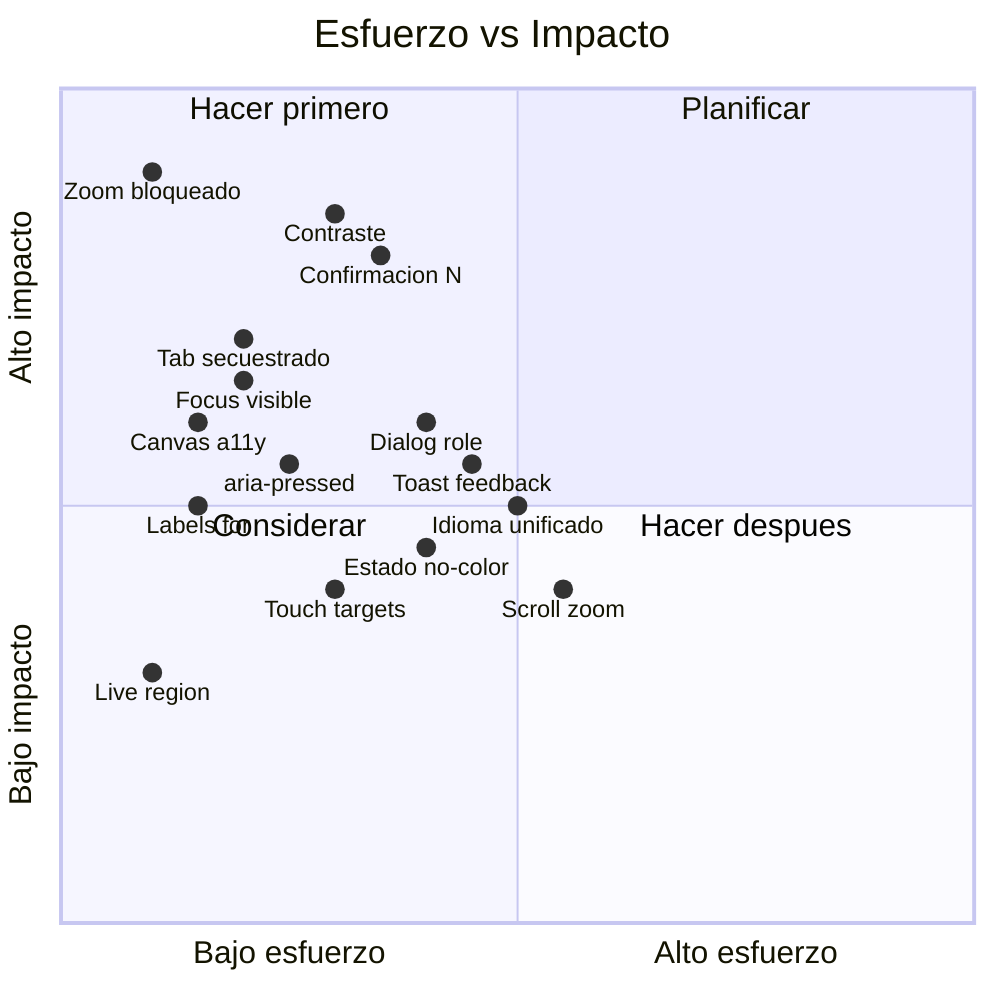

# Filippo 3D v2.2 -- Informe UX / UI / WCAG

## Resumen ejecutivo

Filippo 3D es una herramienta de dibujo 3D pensada para docencia. Su arquitectura es limpia y el modelo de interaccion es coherente, pero presenta deficiencias significativas en accesibilidad (WCAG 2.1 AA), consistencia linguistica de la interfaz y retroalimentacion visual al usuario.

Este informe organiza los hallazgos en tres ejes: accesibilidad (WCAG), experiencia de usuario (UX) e interfaz visual (UI). Cada hallazgo incluye severidad, ubicacion en el codigo y una recomendacion concreta.

## 1. Accesibilidad (WCAG 2.1 AA)

### 1.1 Zoom bloqueado (Criterio 1.4.4 -- Nivel AA)

**Severidad: Alta**

El viewport incluye `user-scalable=no`, lo que impide el zoom en dispositivos moviles. Esto es una violacion directa de WCAG 2.1 AA.

**Archivo:** `index.html`, linea 6

**Recomendacion:** Eliminar `user-scalable=no` del meta viewport. Si se necesita evitar el zoom accidental durante el dibujo, usar `touch-action: none` solo en el canvas (que ya se hace).

### 1.2 Contraste insuficiente (Criterio 1.4.3 -- Nivel AA)

**Severidad: Alta**

Se midieron los ratios de contraste de todos los pares color-fondo usados en la interfaz. Cinco combinaciones no alcanzan el minimo de 4.5:1 para texto normal (AA):

| Par de colores | Ratio | AA normal |
|---|---|---|
| Dark: #666 sobre #141414 (info, status) | 3.21:1 | FAIL |
| Dark: #555 sobre #141414 (opensource) | 2.47:1 | FAIL |
| Light: #888 sobre #f5f5f0 (labels) | 3.24:1 | FAIL |
| Light: #aaa sobre #f5f5f0 (opensource) | 2.12:1 | FAIL |
| Modal: #666 sobre #1e1e1e (dismiss text) | 2.90:1 | FAIL |

**Archivos:** `style.css`, lineas 148, 265-266, 344, 465-467, 498, 514

**Recomendacion:** Subir los tonos claros al menos a #999 en dark mode y #555 en light mode para alcanzar 4.5:1. Para texto secundario que se considere "decorativo" (como el link opensource), usar al menos 3:1 (AA large text).

### 1.3 Canvas sin alternativa accesible (Criterio 1.1.1 -- Nivel A)

**Severidad: Alta**

El canvas p5.js no tiene `role`, `aria-label` ni texto alternativo. Para un lector de pantalla, es un elemento vacio e invisible.

**Archivo:** `js/input.js`, lineas 20-21 (donde se configura el canvas)

**Recomendacion:**
```javascript
_canvas.setAttribute('role', 'img');
_canvas.setAttribute('aria-label', 'Lienzo de dibujo 3D. Use el panel lateral para controles.');
```

### 1.4 Modal sin semantica de dialogo (Criterio 4.1.2 -- Nivel A)

**Severidad: Media**

El overlay de ayuda carece de `role="dialog"`, `aria-modal`, `aria-labelledby` y trampa de foco (focus trap). Tampoco se cierra con Escape (se cierra con "cualquier tecla", lo cual es inusual).

**Archivos:** `index.html` linea 100; `js/input.js` lineas 378-381

**Recomendacion:**
```html
<div id="help-overlay" class="help-overlay hidden"
     role="dialog" aria-modal="true"
     aria-labelledby="help-title">
  <div class="help-card">
    <h2 id="help-title">Filippo 3D -- Referencia de interaccion</h2>
```
Agregar focus trap al abrir y restaurar foco al cerrar. Usar Escape como tecla dedicada de cierre.

### 1.5 Botones toggle sin estado comunicado (Criterio 4.1.2 -- Nivel A)

**Severidad: Media**

Los botones que funcionan como toggle (Grid, Depth, Dark/Light, Draw/Select, Persp/Ortho) no usan `aria-pressed` ni `role="switch"`. Un lector de pantalla no puede distinguir si estan activos o inactivos.

**Archivos:** `index.html` lineas 35-41, 58-60, 67-68; `js/ui.js` (todos los toggles)

**Recomendacion:** Agregar `aria-pressed="true|false"` y actualizarlo junto con el class toggle:
```javascript
btn.setAttribute('aria-pressed', showGrid);
```

### 1.6 Labels no asociados a controles (Criterio 1.3.1 -- Nivel A)

**Severidad: Media**

Los `<label>` del panel no usan `for` ni envuelven sus controles. El color picker y el slider de grosor no estan asociados programaticamente.

**Archivo:** `index.html`, lineas 23-24, 28-29

**Recomendacion:**
```html
<label for="stroke-color">Color</label>
<input type="color" id="stroke-color" value="#ffffff">
```

### 1.7 Tab secuestrado (Criterio 2.1.1 -- Nivel A)

**Severidad: Media**

La tecla Tab esta capturada para abrir/cerrar el panel (`input.js` linea 478), lo que rompe la navegacion por teclado estandar. Esto impide a usuarios de teclado recorrer los controles de la interfaz.

**Recomendacion:** Reasignar la funcion de toggle del panel a otra tecla (por ejemplo, backtick `` ` `` o `Ctrl+Tab`) y liberar Tab para navegacion nativa.

### 1.8 Sin region live para status (Criterio 4.1.3 -- Nivel AA)

**Severidad: Baja**

El contador de trazos (`#status`) se actualiza dinamicamente, pero sin `aria-live`, un lector de pantalla no notifica los cambios.

**Archivo:** `index.html` linea 86

**Recomendacion:**
```html
<div id="status" aria-live="polite" aria-atomic="true">Trazos: 0</div>
```

### 1.9 Sin indicadores de foco visibles (Criterio 2.4.7 -- Nivel AA)

**Severidad: Media**

Ningun boton ni control tiene estilos `:focus-visible`. El reset global (`* { margin: 0; padding: 0 }`) no elimina el outline por defecto, pero tampoco se refuerza.

**Recomendacion:** Agregar al CSS:
```css
.btn:focus-visible,
.cube-face:focus-visible,
.panel-toggle:focus-visible,
.panel-close:focus-visible {
  outline: 2px solid #e74c3c;
  outline-offset: 2px;
}
```


## 2. Experiencia de usuario (UX)

### 2.1 Idioma inconsistente

**Severidad: Media**

La interfaz mezcla espanol e ingles sin criterio claro: "Dibujo" / "Seleccion" pero "Undo" / "Clear" / "PNG" / "Save" / "Open". Las secciones del panel dicen "Acciones" y "Fondo" en espanol, pero los botones dentro son en ingles. El HTML declara `lang="es"` pero el contenido no lo cumple.

**Recomendacion:** Unificar en un solo idioma. Dado que el contexto de uso es docencia en espanol, se sugiere espanol completo: Deshacer, Limpiar, Guardar, Abrir, Imagen, Profundidad. Alternativamente, si se prefiere ingles para la UI por brevedad, cambiar `lang="en"`.

### 2.2 Accion destructiva sin confirmacion

**Severidad: Alta**

`N` (nuevo dibujo) elimina todos los trazos y el historial de undo sin pedir confirmacion. Un docente en medio de una clase puede perderlo todo por una pulsacion accidental.

**Recomendacion:** Implementar un dialogo de confirmacion o, al menos, un doble-tap (presionar N dos veces en menos de 1 segundo). Alternativa minima: mover el atajo a `Ctrl+N` o `Shift+N`.

### 2.3 Sin feedback para acciones de archivo

**Severidad: Media**

Guardar (Save) y exportar PNG no dan ninguna retroalimentacion visual. El usuario no sabe si la accion se ejecuto.

**Recomendacion:** Agregar un toast o notificacion temporal (2 segundos) al completar export/save: "Proyecto guardado" / "PNG exportado".

### 2.4 Label "Vista" repetida

**Severidad: Baja**

El panel tiene dos secciones con el label "Vista": una para los botones del cubo de navegacion (linea 45) y otra para Grid/Depth (linea 57). Esto confunde la jerarquia visual.

**Recomendacion:** Renombrar la segunda a "Visualizacion" o "Opciones de vista", o fusionar ambas secciones.

### 2.5 Help button desincronizado

**Severidad: Baja**

El titulo del boton de ayuda dice "Atajos de teclado (?)" pero el modal se titula "Referencia de interaccion". El label del boton dice "Atajos".

**Archivo:** `index.html` linea 90

**Recomendacion:** Unificar: `title="Referencia de interaccion (?)"` y cambiar el texto a "Ayuda" o "Referencia".

### 2.6 Scroll de profundidad solo con D activo

**Severidad: Baja**

El scroll de la rueda del mouse esta completamente deshabilitado cuando la guia de profundidad esta apagada (`onWheel` retorna inmediatamente). Esto desperdicia un input natural que podria usarse para zoom, una expectativa comun en apps 3D.

**Recomendacion:** Considerar usar scroll para zoom cuando la guia de profundidad esta desactivada.


## 3. Interfaz visual (UI)

### 3.1 Touch targets demasiado pequenos

**Severidad: Media**

El boton de toggle del panel mide 28x28px. Las caras del cubo de navegacion tienen padding de 6px con font-size 11px, resultando en targets de aproximadamente 24x24px. WCAG 2.5.8 (AAA) pide minimo 44x44px; Apple HIG pide 44pt.

**Recomendacion:** Aumentar el tamano minimo de los botones a 36x36px (compromiso razonable) o 44x44px (ideal). Para el cubo de vistas, aumentar padding a 10px.

### 3.2 Estado activo solo por color

**Severidad: Media**

Los botones activos se distinguen unicamente por un cambio de color (rojo #e74c3c). Un usuario con daltonismo protanope (rojo-verde) no puede distinguir el estado activo del inactivo.

**Recomendacion:** Agregar un indicador secundario: borde mas grueso, subrayado, icono de check, o cambio de peso de fuente en los botones activos.

### 3.3 Panel no responsivo

**Severidad: Baja**

El panel tiene ancho fijo de 220px y no adapta su layout en pantallas pequenas. En mobile o tablets en modo portrait, ocupa proporcionalmente demasiado.

**Recomendacion:** Agregar un breakpoint para pantallas menores a 600px que convierta el panel en un drawer de ancho completo o un bottom sheet.

### 3.4 Modal de ayuda sin boton de cierre visible

**Severidad: Baja**

El modal se cierra por click fuera o cualquier tecla, pero no tiene un boton X explicito. Usuarios con poca experiencia pueden no descubrir como cerrarlo.

**Recomendacion:** Agregar un boton de cierre en la esquina superior derecha de `.help-card`.


## 4. Resumen de prioridades



### Acciones inmediatas (bajo esfuerzo, alto impacto)

1. Eliminar `user-scalable=no`
2. Corregir 5 pares de contraste insuficiente
3. Agregar `for` a los labels
4. Agregar `aria-pressed` a botones toggle
5. Agregar `:focus-visible` al CSS
6. Agregar `role` y `aria-label` al canvas
7. Liberar Tab y reasignar toggle del panel

### Acciones a corto plazo

8. Agregar confirmacion a `N` (nuevo dibujo)
9. Semantica de dialogo en modal de ayuda (role, focus trap, Escape)
10. Toast de feedback para save/export
11. Unificar idioma de la interfaz

### Acciones a mediano plazo

12. Indicador de estado activo independiente del color
13. Aumentar touch targets
14. Scroll como zoom cuando depth guide esta apagado
15. Responsividad del panel en mobile
